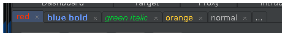
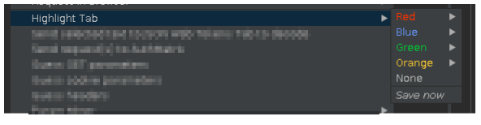

# Burp Repeater Tab Highlighter

This [Burp Suite](https://portswigger.net/burp) extension allows you to highlight Repeater tabs 
in different colours and fonts.

It adds a context menu to a Repeater tab to change the tab's label colour. Right-click the 
request/response body, not the tab itself!

The colours are stored in a new entry on the site map, http://tabhighlighterextensionjava.local/state. 
This is updated when the plugin unloads (either shutting down Burp or reloading the extension), and should
be saved on every change. This entry is also added to your project scope, so that if you save a copy of the 
project and only include in-scope items it will include the highlights. 

However, this means that if Burp crashes you _might_ lose settings, or things might get confused if 
you've inserted (not added to the end) or moved Repeater tabs. Additionally, if you insert/move 
tabs without the extension running things might get confused. 

